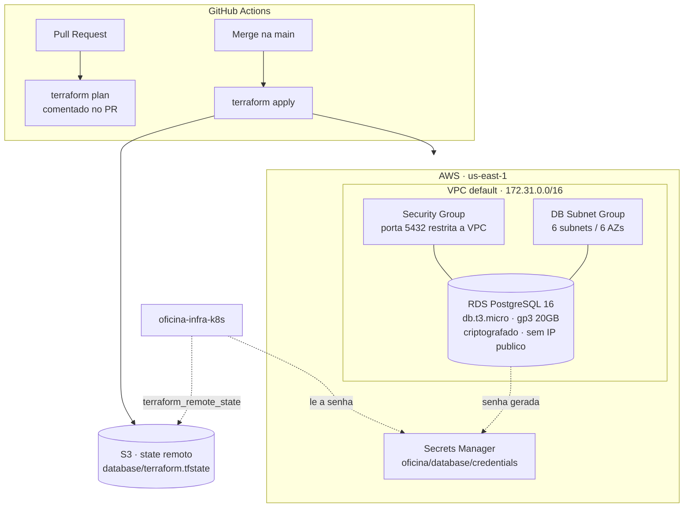

# oficina-infra-database

Provisionamento do **banco de dados gerenciado** da Oficina API — Tech Challenge SOAT, Fase 3.

Este repositório é responsável por **uma única coisa**: a instância **Amazon RDS PostgreSQL**, sua rede, suas credenciais e a publicação dos dados de conexão para os demais repositórios. Ele não conhece o cluster Kubernetes nem a aplicação.

## Tecnologias

- **Terraform** `>= 1.9` com backend remoto em **S3** + lock em **DynamoDB**
- **Amazon RDS for PostgreSQL 16**
- **AWS Secrets Manager** para as credenciais
- **GitHub Actions** para CI/CD (validate → plan em PR → apply em merge)

## Arquitetura



## Decisões de projeto

**VPC default em vez de VPC dedicada.** Uma VPC própria exigiria NAT Gateway (~US$ 32/mês) para as subnets privadas. O AWS Academy Learner Lab dispõe de US$ 50 de crédito total, então a VPC default — que já traz subnets públicas em todas as AZs — é a escolha que preserva o orçamento sem comprometer o isolamento: o banco **não** recebe IP público e só aceita conexões originadas de dentro da VPC.

**Senha gerada pelo Terraform, nunca versionada.** `random_password` gera a senha no apply e ela é escrita direto no Secrets Manager. Nenhum valor sensível aparece no repositório, no `terraform.tfvars` ou nos logs do pipeline. O state fica em S3 com `encrypt = true`.

**`skip_final_snapshot = true` e `deletion_protection = false`.** Configuração adequada a um ambiente acadêmico onde o ciclo `apply`/`destroy` é frequente e o crédito é finito. Em produção real ambos seriam invertidos.

**Sem Performance Insights e sem Enhanced Monitoring.** O Learner Lab não permite criar a IAM role de monitoramento que esses recursos exigem. A observabilidade do banco é feita pelas métricas padrão do CloudWatch e pelos dashboards do Grafana no repositório `oficina-infra-k8s`.

## Modelagem de dados

O schema é aplicado pelas migrations do TypeORM no repositório `oficina-api`. O diagrama ER e a justificativa da modelagem estão em [`oficina-api/docs/MODELAGEM.md`](https://github.com/fdacmatheus/oficina-api/blob/main/docs/MODELAGEM.md).

## Execução

### Pré-requisitos

- Terraform `>= 1.9`
- Credenciais AWS válidas (no Learner Lab, copie de **AWS Details → AWS CLI**)
- Bucket de state e tabela de lock já criados:

```bash
aws s3api create-bucket --bucket oficina-tfstate-679445922616 --region us-east-1
aws s3api put-bucket-versioning --bucket oficina-tfstate-679445922616 \
  --versioning-configuration Status=Enabled
aws dynamodb create-table --table-name oficina-tflock \
  --attribute-definitions AttributeName=LockID,AttributeType=S \
  --key-schema AttributeName=LockID,KeyType=HASH \
  --billing-mode PAY_PER_REQUEST
```

### Deploy

```bash
terraform init
terraform plan
terraform apply
```

A criação da instância leva de **8 a 12 minutos**.

### Consultar a conexão

```bash
terraform output db_endpoint
aws secretsmanager get-secret-value \
  --secret-id oficina/database/credentials \
  --query SecretString --output text | jq
```

### Destruir

```bash
terraform destroy
```

> Rode o `destroy` assim que terminar os testes. A instância custa ~US$ 0,017/h e consome o crédito do laboratório mesmo ociosa.

## Variáveis

| Variável | Padrão | Descrição |
| --- | --- | --- |
| `region` | `us-east-1` | Única região liberada no Learner Lab |
| `project` | `oficina` | Prefixo dos recursos |
| `db_name` | `oficina` | Nome do banco |
| `db_username` | `oficina` | Usuário master |
| `db_instance_class` | `db.t3.micro` | Classe da instância |
| `db_allocated_storage` | `20` | Armazenamento em GB |
| `engine_version` | `16.15` | Versão do PostgreSQL |
| `allowed_cidr_blocks` | `[]` | CIDRs extras liberados na 5432 |

## Outputs

| Output | Consumido por |
| --- | --- |
| `db_endpoint` | `oficina-api` (variável `DB_HOST`) |
| `db_port` | `oficina-api` |
| `db_name` | `oficina-api` |
| `db_security_group_id` | `oficina-infra-k8s`, para liberar os nodes do EKS |
| `db_secret_arn` | `oficina-infra-k8s` e `oficina-lambda-auth` |
| `db_secret_name` | `oficina-api` |

## CI/CD

[`.github/workflows/terraform.yml`](.github/workflows/terraform.yml)

| Gatilho | Ação |
| --- | --- |
| Pull Request | `fmt` + `validate` + `plan` comentado no PR |
| Push em `homolog` | Apply no ambiente de homologação |
| Push em `main` | Apply no ambiente de produção |
| `workflow_dispatch` com `destroy` | Destrói a infraestrutura |

**Secrets necessários** no repositório: `AWS_ACCESS_KEY_ID`, `AWS_SECRET_ACCESS_KEY`, `AWS_SESSION_TOKEN`.

> No Learner Lab o token expira a cada sessão do laboratório — é preciso reatualizar os três secrets antes de rodar o pipeline.

## Repositórios relacionados

| Repositório | Papel |
| --- | --- |
| [`oficina-api`](https://github.com/fdacmatheus/oficina-api) | Aplicação principal em Kubernetes |
| [`oficina-infra-k8s`](https://github.com/fdacmatheus/oficina-infra-k8s) | Cluster EKS, API Gateway e observabilidade |
| [`oficina-lambda-auth`](https://github.com/fdacmatheus/oficina-lambda-auth) | Function serverless de autenticação por CPF |
